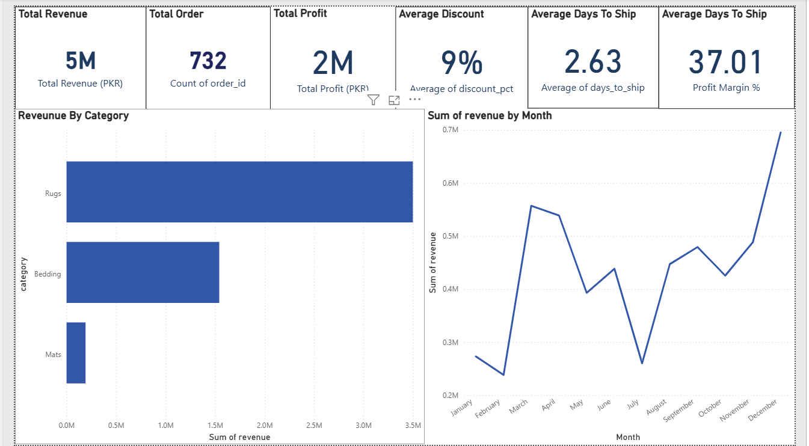
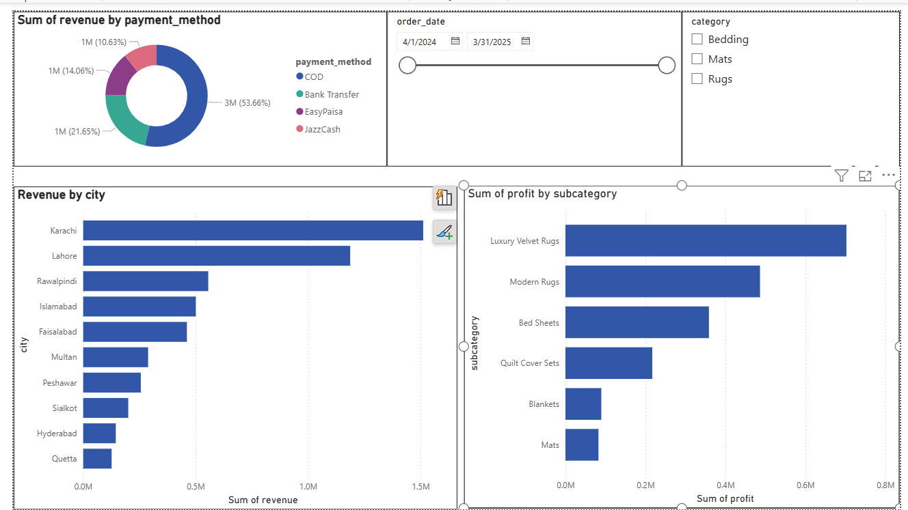
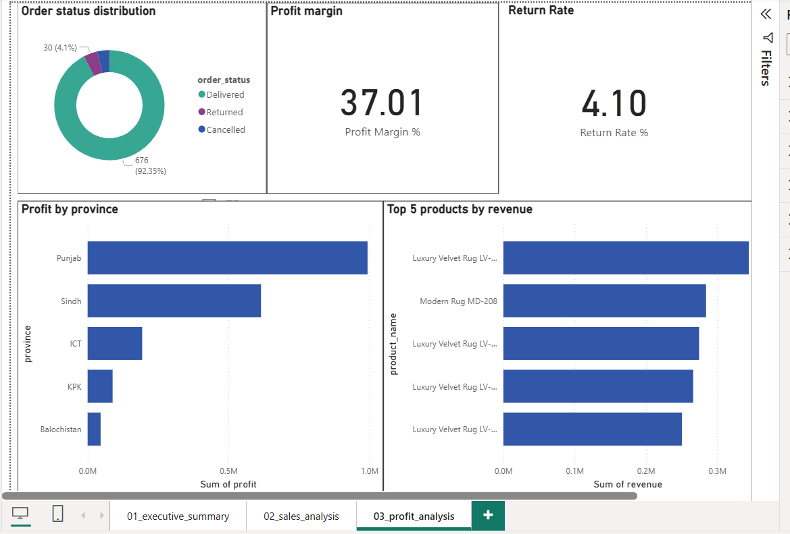

# 📊 Power BI Dashboards

> Interactive business dashboards built with Power BI — turning raw data into actionable insights.

---

## 🏠 Dashboard 1 — Pakistani E-Commerce Sales Analysis
### *Apr 2024 – Mar 2025 | 732 Orders | 18 Variables*

A complete end-to-end business intelligence dashboard analyzing 
one year of sales data from a Pakistani home decor e-commerce store.
Built across 3 interactive pages with slicers, KPI cards, and drill-down visuals.

---

## 🔴 Live Dashboard
### [▶ Click Here to View Interactive Dashboard](https://app.powerbi.com/groups/me/reports/021e9020-ea35-4027-b3b2-21e3bda210d7/81969c2538fee3260a67?experience=power-bi)

---

## ❓ Business Questions Answered

| # | Question | Answer |
|---|----------|--------|
| 1 | Which category drives most revenue? | Rugs — 3x more than Bedding |
| 2 | Which city places most orders? | Karachi (28%) followed by Lahore (22%) |
| 3 | When do sales peak? | December — consistent every year |
| 4 | How do customers prefer to pay? | COD dominates at 53.66% |
| 5 | Which products are highest risk of stockout? | Luxury Velvet Rugs LV-326, MD-208 |

---

## 💡 Key Findings

- **💰 Total Revenue** → 5M PKR  
- **📦 Total Orders** → 732  
- **📈 Profit Margin** → 37%  
- **✅ Delivery Rate** → 92.35%  
- **💳 COD Dominance** → 53.66% of payments  
- **🏆 Top Province** → Punjab  

- **Rugs are the profit engine** — Luxury Velvet Rugs alone contribute highest revenue per unit  
- **Karachi + Lahore = 50% of all orders** — marketing budget should focus here  
- **December spike is predictable** — inventory must be stocked by November  
- **37% profit margin is healthy** — but discount management can push it higher  
- **92.35% delivery success** — strong operational performance

- **Rugs are the profit engine** — Luxury Velvet Rugs alone contribute the highest revenue per unit
- **Karachi + Lahore = 50% of all orders** — marketing budget should focus here
- **December spike is predictable** — inventory must be stocked by November
- **37% profit margin is healthy** — but discount management can push it higher
- **92.35% delivery success** — strong operational performance

---

## 📸 Dashboard Preview

### Page 1 — Executive Summary

> *KPI cards, revenue by category, monthly sales trend*

### Page 2 — Sales Analysis  

> *Revenue by city, payment method breakdown, profit by subcategory*

### Page 3 — Profit Analysis

> *Order status, profit by province, top 5 products, profit margin*

---

## 🗂️ Dashboard Pages

### Page 1 — Executive Summary
- 5 KPI Cards: Revenue, Orders, Profit, Discount %, Ship Days
- Bar Chart: Revenue by Category
- Line Chart: Monthly Revenue Trend
- Slicer: Filter by Category

### Page 2 — Sales Analysis
- Donut Chart: Revenue by Payment Method
- Bar Chart: Revenue by City
- Bar Chart: Profit by Subcategory
- Slicer: Filter by Category + Date Range

### Page 3 — Profit Analysis
- Donut Chart: Order Status Distribution
- Bar Chart: Profit by Province
- Bar Chart: Top 5 Products by Revenue
- KPI Card: Profit Margin % (DAX Measure)

---

## 🛠️ Tools & Skills Used

- **Power BI Desktop** — dashboard design & publishing
- **DAX** — custom measures (Profit Margin %, Return Rate %)
- **Power Query** — data transformation & type formatting
- **Excel** — data preparation

---

## 📁 Project Structure

    powerbi-dashboards/
    ├── arabian_homestyle_sales.csv     → Dataset (732 rows)
    ├── powerbi_analysis.pbix           → Power BI project file
    ├── page1_executive_summary.png     → Dashboard screenshot
    ├── page2_sales_analysis.png        → Dashboard screenshot
    ├── page3_profit_analysis.png       → Dashboard screenshot
    └── README.md

---

## 📋 Dataset Details

| Property | Detail |
|----------|--------|
| Period | April 2024 – March 2025 |
| Rows | 732 orders |
| Columns | 18 |
| Categories | Rugs, Bedding, Mats |
| Cities | 10 Pakistani cities |
| Payment Methods | COD, Bank Transfer, EasyPaisa, JazzCash |

---

## 👤 Author

**Ahtisham Syed** — Aspiring Data Analyst

---

*⭐ If you found this useful, consider giving this repo a star!*    
